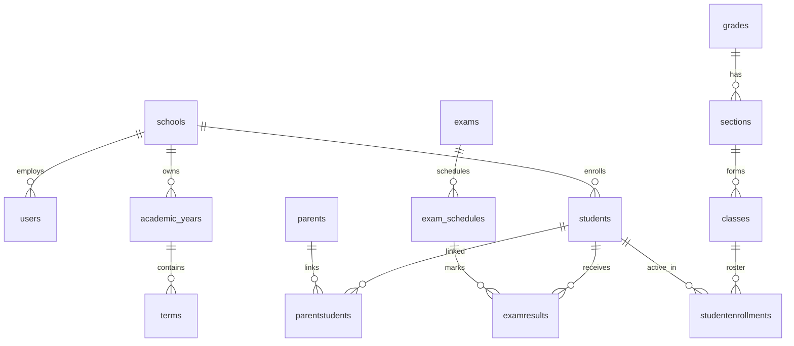

# Database Overview

PostgreSQL with **schema-per-domain** layout. Migrations live in `hasura/hasura/migrations/` (115+ versions).

## Entity relationship (logical)

## Schemas

### `tenancy`

| Table | Purpose |
|-------|---------|
| `schools` | Tenant root: name, plan, status, trial |

### `identity`

| Table | Purpose |
|-------|---------|
| `users` | Login accounts (`school_id`, email, password_hash) |
| `roles`, `userroles` | RBAC per school |
| `permissions`, `rolepermissions` | Fine-grained grants |
| `audit_logs` | School-scoped audit trail |

### `academic`

| Table | Purpose |
|-------|---------|
| `academicyears`, `terms` | Calendar |
| `grades`, `sections`, `classes` | Structure |
| `subjects`, `class_subjects` | Curriculum |
| `teachers`, `teacherassignments` | Staffing |
| `parents`, `parentstudents` | Portal parents |
| `timetable_slots` | Weekly schedule |
| `attendance` | Daily attendance (table name may vary — see `ATTENDANCE_TABLE` util) |

### `student`

| Table | Purpose |
|-------|---------|
| `students` | Student profile |
| `studentenrollments` | Section/class enrollment |
| `student_documents`, `student_notes` | Extended profile |

### `operations`

| Table | Purpose |
|-------|---------|
| `exams`, `exam_schedules`, `examsubjects` | Assessments |
| `examresults` | Marks (`mark_status` workflow) |
| `exam_types`, `term_assessment_weights` | Grading config |
| `grading_scale_profiles`, `grading_scales` | Letter grades |
| `computed_results`, `computation_runs` | Aggregated grades |
| `announcements` | School notices |

### `finance`

| Table | Purpose |
|-------|---------|
| `invoices`, `invoiceitems`, `payments` | Student billing |
| `payroll_runs`, `financial_transactions` | Staff finance |

### `library`

| Table | Purpose |
|-------|---------|
| `resources`, `resource_section_shares` | Learning materials |

### `planning`

Lesson plans, units, continuous assessment (Ethiopia curriculum support).

## Migration tracking

| Mechanism | When |
|-----------|------|
| `hdb_catalog` (Hasura) | Hasura CLI `migrate apply` |
| `public.sms_dev_migrations` | `migrate-neon-psql.sh` / `sms-dev.sh migrate-psql` |

Keep both in sync when using Hasura Cloud.

## Soft delete

Many tables use `is_deleted` or `deleted_at`. Queries should filter `COALESCE(is_deleted, false) = false` where applicable.

## Indexes

High-scale migrations add indexes on `(school_id, ...)`, `(student_id, exam_id)`, mark status, etc. Review latest migrations under `178*_high_scale` and `1780500000000_grading_system_foundation`.
